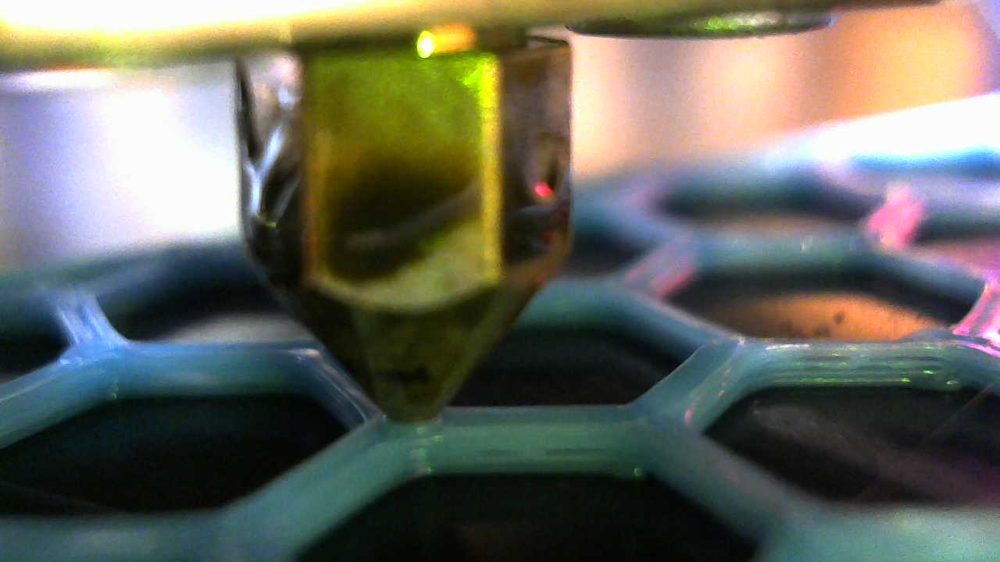

*Reminder*
*   *Do not miss [deadline](https://su2.utia.cas.cz/labs.html#projects) for uploading your implementation and documentation of your final project.*
*   *Include working demo in Colab, in which you clearly demonstrate your results. Please refer to the Implementation section on the [labs website](https://su2.utia.cas.cz/labs.html#projects).*
*   *Do not upload huge datasets to GitHub repository.*

* **Detekce anomálií při 3D tisku v reálném čase** *

 **Úvod do problematiky** 

3D tisk je v akademickém i businessovém protředí znám již poměrně dlouhou dobu a je považován za jedno z nejprespektivnějších odvětví průmyslu 4.0. Masová implementace 3D tisku se ovšem i dnes stále střetává s výzvami, které čekají na vyřešení. Jednou z nejvýznamnějších je detekce tiskových chyb a jejich včasná korekce. Zásadními proměnnými při 3D tisku je pozice vstřikovací trysky, rychlost vstřikování, množství a teplota filamentu (vstřikovaného materiálu). Správná kombinace těchto veličin je klíčovým kritériem dosažení bezchybného tisku a vychýlení byť jen jedné z těchto čtyř hodnot nevyhnutelně vede k tiskovým anomáliím. Cílem našeho projektu je detekovat tiskové anomálie prostřednictvím detekce nesprávných hodnot všech čtyř výše zmíněných veličin.

**Metodologie**

Vycházíme z předpokladu, že správnost pozice vstřikovací trysky, rychlosti vstřikování, množství a teploty filamentu lze rozpoznat v reálném čase vizuálně. Informace o všech čtyřech veličinách je tedy přenositelná přes vizuální záznam tiskové procedury. Pro detekci nesprávných hodnot navrhujeme použití námi nadesignované konvoluční neuronové sítě, která je k tomuto účelu natrénována na fotografiích zachycujících průběh tisku. Podobně postupují například Brion a Pattinson (Brion, D.A.J., Pattinson, S.W. Generalisable 3D printing error detection and correction via multi-head neural networks. Nat Commun 13, 4654 (2022). https://doi.org/10.1038/s41467-022-31985-y). Naši neuronovou síť jsme natrénovali na stejném datasetu, který pro trénování použili i autoři výše zmíněného článku. Mimo námi navrhnuté neuronové sítě jsme pro detekci nesprávných hodnot veličin natrénovali na stejném datasetu také upravenou verzi ResNetu. Výsledky trénovaní naší sítě zhodnotíme srovnáním s výsledky Briona a Pattinsona a s výsledky pro námi upravený ResNet.

**Trénovací data** 

Při trénování našich modelů jsme použili dataset sestavený Brionem a Pattinsonem (Brion, D., & Pattinson, S. (2022). Data set for “Generalisable 3D printing error detection and correction via multi-head neural networks”. Apollo - University of Cambridge Repository. https://doi.org/10.17863/CAM.84082). Dataset se skládá z 1,272,273 anotovaných fotografií pořízených kamerami umístěnými na trysce 3D tiskárny. Kamera zachycuje pohyb trysky, její pozici vůči výrobku a aplikaci filamentu v reálném čase s frekvení 2,5 Hz. Celkem je takto zaznamenán tisk 192 komponentů různých tvarů, barev a za různých světelných podmínek na osmi různých tiskárnách. Anotace každé fotografie obsahuje klasifikaci pozice trysky, množství, rychlosti a teploty vstřikovaného filamentu. Veličiny jsou klasifikovány jako 'low', 'good' nebo 'high'. Součástí anotace jsou také souřadnice pixelu, který představuje hrot vstřikovací trysky.  

V rámci prepocessingu jsou jednotlivé fotografie náhodně zrotovány, obráceny a jsou změněny a upraven jejich jas, kontrast, saturace a odstíny. Každá fotografie je navíc oříznuta do velikosti 320x320 pixelů se souřadnicovým středem v hrotu trysky. Před vstupem do konvoluční sítě je ještě aplikováno další náhodné oříznutí a resize, které fotografii transformují na obrázek o rozměrech 224x224 pixelů. Takto upravené fotografie již slouží jako vstup do úvodních konvolučních vrstev všech námi trénovaných modelů.

**Stručný popis použitých architektur**

* **Upravený ResNet:** Základ této neuronové sítě je předtrénovaný ResNet50 z balíku torchvision. ResNet50 se skládá z úvodní konvoluční vrstvy, maxpoolingu a následně šestnácti reziuálních bloků, z nichž každý z nich tvoří tři konvoluční vrstvy a skip connection. Síť je po aplikaci average poolingu zakončena plně propojenou lineární vrstvou. My jsme architekturu Resnetu50 upravili tak, že jsme finální lineární vrstvu nahradili identitou a napojili na ni čtyři vzájemně nezávislé plně propojené vrstvy. Každá z těchto vrstev slouží k natrénování na identifikaci jedné ze čtyř sledovaných veličin. Výstupem každé vrstvy je třídimenzionální vektor reprezentující 3 možnosti klasifikace: 'low', 'good', 'high'. 

* **Architektura z článku:** Konvoluční síť z článku na vstupní fotografii nejprve aplikuje konvoluci a maxpooling. Poté následuje zřetězení tří transformací. Každá z nich se skládá z reziduální vrstvy, na kterou je následně napojena attention jednotka. Je důležité zmínit, že v této sérii jsou všechny tři reziduální vrstvy totožné, zatímco attention jednotky se mění. Každá attention jednotka tedy principiálně detekuje jinou třídu vztahů v obrázku. Výstup z této série putuje přes tři další tři reziduální vrstvy do average poolingu, který data připraví pro vstup do čtyř nezávislých plně propojených lineárních vrstev. Každá z těchto vrstev se opět trénuje na klasifikaci hodnot jedné ze čtyř sledovaných veličin.

* **Námi navrhnutá architekura - RosNet:** RosNet je částečně inspirován architekturou sítě navržené Pattinsonem a Brionem. V architektuře jsme ponechali tři nezávislé attention jednotky, nicméně namísto reziduálních bloků jsme se rozhodli pro využití architektury U-Netu. RosNet je zřetězením tří na sebe napojených U-netů. Architektura každého U-netu je stejná: tvoří ji jeden down step, složený ze dvou konvolucí a max-poolingu, a jeden upstep, který tvoří transponovaná konvoluce a opět dvě klasické konvoluce. Mezi down-stepem a up-stepem je vždy umístěna attention jednotka. V každé instanci U-netu má attention jednotka jiné parametry tak, aby každá z těchto tří jednotek mohla postihnout jiné vztahy a soustředit se na jinou oblast v obrázku. Výstup tříčlenné série těchto U-netů je transformován pomocí flatten mechanismu a slouží jako vstup pro 4 na sobě nezávislé plně propojené lineární vrstvy, kdy každá z nich se trénuje na klasifikaci hodnot jedné ze čtyř sledovaných veličin.

**Trénování**

Experimenty jsme spouštěli na školním výpočetním clusteru Helios. Vzhledem k velmi vysoké velikosti používaného datasetu a omezené výpočetní kapacitě, kterou jsme měli k dispozici, jsme museli přizpůsobit objem trénovacích dat a počet epoch tak, abychom stihli všechny modely natrénovat. Testovali jsme několik strategií a jako nejoptimálnější počet vzorků ve smyslu poměru času který zabere samotné načítání dat a trénink nám vyšel počet obrázků 113 224. Podmnožina dat byla vybrána tak, aby zahrnovala různé kombinace parametrů (hotend_class, z_offset_class, feed_rate_class, flow_rate_class) a byla reprezentativní pro celé spektrum podmínek. Data s velkými chybami nebo špatným osvětlením byla odfiltrována. Množinu jsme rozdělili na trénovací, validační a testovací vzorek ve vzájemném poměru 70/20/10. Před tréninkem data prošla již zmiňovanou sérií transformací. Testovací a validační obrázky byly pouze oříznuty tak, aby byly centrovány přímo na tiskovou trysku a následně byly znormalizovány.

Vzhledem k tomu, že všechny modely jsou zakončeny čtyřmi nezávislými hlavami, je pro každý model nastavena stejná ztrátová funkce. Pro každou hlavu používáme klasickou křížovou entropii a minimalizujeme součet těchto čtyř entropií 

Každý model byl optimalizován pomocí AdamW s počátečním learning rate 0.001. Scheduler ReduceLROnPlateau byl zvolen, aby se přizpůsobil stagnujícímu učení. Parametry early stopping (patience = 10 epoch) byly stanoveny na základě experimentů.

Pro hodnocení výkonů našich modelů byly použity metriky accuracy, F1 score, recall precision.

Experimenty jsme spouštěli na výpočetním uzlu vybaveném grafickými kartami NVIDIA A100 PCIe.
